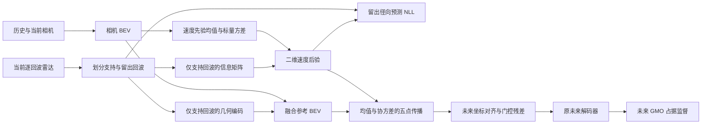

# RadarFlowOcc M3：可观测性约束的速度后验与未来特征迁移

日期：2026-09-06。状态：**研究原型；尚无 M3 完整训练、验证集精度或顶会录用依据。**

目标是把 M2 的辅助径向损失改为真正参与推理的运动机制，并围绕一个可证伪的问题组织论文：**当雷达只能观测部分运动方向时，保留未观测方向的不确定性，是否比确定性速度修正更有利于未来占据预测？** 公式工具本身不是新颖性主张。

代码位于独立工作树 `code/Drive-OccWorld-m3`，分支 `codex/m3-observable-transport`。起点为 `c406d5a72a5c077876326e900d959edbded3891c`，另带入已经完成的 future-metadata-only 与 occupancy target 下采样优化。原工作树及 L40S 上正在运行的 M1 未修改。新方法的额外计算成本尚未测得，不能沿用 M1 的加速比。

## 1. 从 M0–M2 到 M3

| 版本 | 速度从哪里来 | 是否驱动未来推理 | 主要边界 |
|---|---|---|---|
| M0 | 雷达缓存均值速度作为融合特征 | 隐式 | 几何、速度与网络容量混合，贡献难分离 |
| M1 | 雷达栅格中裁剪后的 vx/vy | 是，确定性 advection | 编码值被当物理量；旧 sweep 动态错位；近似 warp |
| M2 | 融合 BEV 的辅助 flow 头 | 否，仅辅助监督 | 输入重建捷径；分别平均 LOS 与径向速度破坏约束 |
| M3 | 相机时序先验 + 逐回波约束的二维速度后验 | 是，同一均值/协方差进入 train/test rollout | 条件 Gaussian、格内共享速度、常速度传播等假设待检验 |

论文主线不应是“多加三个模块”。必须围绕 **观测方向 → 后验方向性 → 未来迁移 → 预测误差** 建立证据链。

## 2. 输入与任务范围

- 基础任务保持 Drive-OccWorld 的 GMO / non-GMO 条件占据预测，时域为当前及未来 0.5、1、1.5、2 秒。GMO 指一般可移动物体，包含静止车辆；non-GMO 不能统称 free space。
- 历史两帧及当前六视角相机进入相机 BEV；M3 雷达输入仅来自当前 sample 的五部雷达，每部默认一个 sweep，进一步过滤 `0 ≤ lag ≤ 0.15 s`。
- 雷达方向使用实际传感器原点，并与位置、速度统一到当前 `LIDAR_TOP` 坐标系。
- nuScenes 输入中的径向标量，是将其 ego-motion-compensated velocity 投影到 LOS 得到的数值，**不是直接读取原始频谱的独立 Doppler 观测**。论文和数据说明必须保留这一限制；理想情况下增加原生径向速度数据验证。
- 系统继续使用 LiDAR 派生的占据标签，以及**给定的未来 GT ego transform/action**。这是条件预测协议；不能宣称完全自监督、未知未来动作的部署式世界模型或闭环规划。
- 单 sweep 缩小了时间错位范围，并未完成目标运动时间补偿。15 m/s 运动在 0.1 s 内仍可错位 1.5 m；这是单位计算，并非实际数据统计。

每帧雷达输入为 `[4096,9]` float32：

`x, y, z, rcs, ux, uy, radial_velocity_mps, lag_seconds, valid`。

径向速度不经 ±20 m/s 裁剪。多于 4096 点时按 token 确定性抽样，选择不依赖速度值；需要报告真实截断率。训练中的支持/留出划分在模型内进行，缓存不提前固定划分。NPZ 缓存包含配置与数据根目录身份，不能复用 M1/M2 的 BEV 缓存。

## 3. 一个后验贯穿监督与预测

### 3.1 相机先验

从**融合雷达之前**的时序相机 BEV 预测每格二维速度均值 `μ₀` 与正标量标准差 `s₀`。首版使用各向同性先验 `Σ₀=s₀²I`，使“未观测方向保持先验”成为明确的结构性质。当前实现以 3×3、1×1 卷积产生三个输出，标准差通过有界 sigmoid 落在 0.5–15 m/s，初始 5 m/s。这些为初始超参数，尚未调优。

### 3.2 保留每条视线的约束

同一格内支持回波满足近似模型：

\[
r_i=u_i^\top v+\epsilon_i,\qquad
\epsilon_i\sim\mathcal N(0,\sigma_i^2),\qquad
\sigma_i^2=\sigma_r^2+(a_\mathrm{lag}\tau_i)^2.
\]

首版 `σᵣ=1.5 m/s`，`a_lag=3 m/s²`，只对时差造成的速度不确定性做启发式增量，**不修复点的位置错位**。

\[
A=\sum_i\sigma_i^{-2}u_i u_i^\top,\quad
b=\sum_i\sigma_i^{-2}u_i r_i,\quad
\alpha=s_0^{-2},
\]
\[
\Sigma=(A+\alpha I)^{-1},\qquad
\mu=\mu_0+\Sigma(b-A\mu_0).
\]

实现使用 FP32 物理计算，显式求解二维系统。不同方向的约束累加为信息矩阵，避免“先平均径向速度、再归一化平均方向”的非物理目标。

**可检验性质。** 对任意 `n∈null(A)`，在各向同性先验和上述独立噪声模型下，`nᵀμ=nᵀμ₀`，且该方向后验方差保持先验。只有增加独立观测方向，才能增加相应方向的信息。这是标准线性 Gaussian 模型的性质，应作为方法解释与验证，不能包装成新贝叶斯理论。

### 3.3 留出回波预测

训练时约 20% 有效回波成为留出集合 B，其余为支持集合 A。**先划分，再构建所有雷达条件**：信息矩阵、信息向量与几何编码均只读 A。雷达几何编码保留存在、数量、高度、RCS、时间信息，旧布局的 vx/vy/speed 三通道置零。

对 B 中回波计算后验预测分布：

\[
p(r_j\mid A,C)=\mathcal N(u_j^\top\mu,\;u_j^\top\Sigma u_j+\sigma_j^2).
\]

总损失：`L = L_occ + 0.05 L_heldout_NLL`。这里的系数尚待预先规定的验证集选择。推理时使用全部有效回波。

这只能证明该回波没有直接进入当前条件；空间邻近回波仍可能强相关。正式实验还需按传感器或回波组留出，不能把随机点留出称为独立外推证据。相机先验同样受到占据损失监督，不是无监督速度真值。

### 3.4 协方差进入未来迁移

对 `Σ=LLᵀ` 使用五个速度支持点：

\[
v^{(0)}=\mu,\quad v^{(1,2)}=\mu\pm\sqrt3L_{:,1},\quad
v^{(3,4)}=\mu\pm\sqrt3L_{:,2},
\]

权重为 `1/3,1/6,1/6,1/6,1/6`，匹配均值和协方差。将 256 维融合参考特征先压到 32 维，再按 `x+t v^(k)` **前向双线性 splat** 到参考坐标中的未来位置，对合并后的权重归一化，最后采样到给定的未来 ego 坐标并映射回 256 维，作为未来 query 的门控残差。

每个时域均从同一个实测参考帧出发，不用生成帧伪造新的雷达观测。门控初始化为零；这保留初始化时的主干行为，但不意味着第一步就有完整运动分支梯度。开门后，未来特征损失可传至速度均值和方差；先验从初始步即可通过留出 NLL 学习。

**必须限定：** 这是速度后验的数值特征传播近似；场外贡献被丢弃，碰撞按特征权重归一化，不是物理占据质量守恒。非线性占据解码器作用于平均特征，不等于对占据概率做精确积分。它也不建模转向、加速度、多模态意图和跨格相关性，不能称为完整未来世界概率分布。

## 4. 与已有工作的区别需要怎样成立

[4DR360 v2](https://arxiv.org/html/2607.09629v2) 已有速度修正和动态 warp；[3D Radar Velocity Maps](https://arxiv.org/abs/2107.11039) 已有贝叶斯速度后验；[2017 DOGMa](https://arxiv.org/abs/1705.08781) 已有速度协方差地图和粒子预测；[CRISP](https://arxiv.org/html/2607.04541v1) 已有相机—雷达未来占据预测。

因此候选贡献限定为：在学习式相机—雷达未来占据任务中，使**逐回波可观测信息决定同一速度后验的均值、方向方差与未来特征传播**，并通过无直接测量泄漏的留出实验和因果消融验证这条链路。有限文献检索不能证明不存在相同组合；详细对照见 `literature_review.md`。

若完整后验迁移不优于均值迁移，或者收益与观测退化程度无关，应缩小或放弃“可观测性传播”的主张，而不是换一个宏大名称。

## 5. 正式实验设计

### 5.1 公平主表

共同固定：数据划分、样本 token、占据标签、未来 ego 条件、训练图像尺寸 720、BEV 200×200、全局 batch、24 轮预算、学习率、增强、初始化、软件版本和评估脚本。核心比较至少 3 个随机种子；短续训结果另列探索表。

主表包括 Camera、M0、M1、M2、M1+M2、M3，以及 IR-WM 等更强视觉底座。CRISP/4DR360 若无官方可运行代码，用清楚标明的机制适配作补充，不能称官方复现，也不能把不同任务原文数值拼成排行榜。

初始化还需审计上游 `frozen_stages=1`、`norm_eval=True`、BN affine 不训练的设置：对预训练骨干有其原始协议含义，对 scratch 则会冻结随机浅层特征。配置工具会记录这些字段；正式主表应优先使用同一预训练初始化，或让所有 scratch 对照共同采用明确的骨干训练规则。现有 M1 的中途结果不能因此自动成为公平对照。

M3 默认单 sweep，而历史 M0/M1/M2 用 5 sweeps。必须同时提供**统一单 sweep 的方法控制表**和各方法原设定表，避免把时间窗变化当作模型优势。若比较精确 per-return 输入与旧裁剪缓存，还应增加“不裁剪的确定性均值迁移”控制。

### 5.2 必须做的消融与负控制

| 比较 | 控制目的 | 当前代码入口/状态 |
|---|---|---|
| M3 full vs mean | 协方差是否必要 | `transport_mode='sigma'/'mean'` |
| full vs prior-only | 雷达信息更新是否必要 | `use_doppler_update=False` |
| full vs no transport | 辅助监督是否真的通过 rollout 起作用 | `transport_mode='off'` |
| full vs isotropic | 方向性是否优于同 trace 的模糊 | `covariance_mode='isotropic'` |
| full vs rotated | 错误方向的不确定性是否破坏收益 | `covariance_mode='rotated'`，旋转 90° |
| 真实/置乱径向速度或 LOS | 真实运动几何是否必要 | 待实现数据干预工具；不可称已完成实验 |
| 随机点/整雷达留出 | 相关回波是否造成乐观 NLL | 后者待扩展，需增加 sensor_id 数据字段 |
| age ≤0.05 /0.10 /0.15 s | 时差和有效回波数量的权衡 | 同步修改 loader 与 posterior 时间阈值，单独缓存 |
| Gaussian / 鲁棒噪声更新 | 冲突回波是否导致错误高置信度 | 鲁棒更新尚未实现，列为投稿前风险处置 |
| 同初始化同预算、参数容量匹配 | 是否只是增加相机头容量 | 需训练控制模型 |

### 5.3 主指标与切片

主指标为每个时域 GMO IoU，另报 non-GMO IoU、二类 mIoU、未来总体 IoU（汇总混淆矩阵）与远期结果，禁止只展示 current+future 聚合。M3 评估保留 sample/scene token 与逐时域混淆矩阵，按 token 去重后才聚合。场景 bootstrap 给出区间，模型差值使用配对场景重采样；跨种子变化单独报告，不能被 bootstrap 替代。

真正 moving/static 切片需独立轨迹/速度标注及明确阈值，不能直接拿 GMO/non-GMO 充当。投稿前增加距离、速度、雷达覆盖、LOS 角度跨度/信息矩阵特征值分桶，报告每桶样本数与有效覆盖率。遮挡/夜间切片使用数据集元数据或预先固定的掩码，不能事后挑图。

留出观测另外报告径向 MAE、预测 NLL、50/80/95% 区间覆盖率、按可观测性分桶的校准。不能从径向校准推出完整二维速度校准；没有完整速度标签时必须保留这个未知。

本实现未接通真实 instance flow/VPQ 评估，因此 M3 省略 VPQ，不能使用旧 `0.1` 占位值。若将 VPQ 作为主结果，需要另行实现实例跟踪与正确评估。

### 5.4 系统成本

分别报告参数量、训练峰值显存、batch=1 推理延迟及四卡训练 step 时间。统一 SSD 路径、数据增强、workers 和 warm-up 窗口。先进行不影响 M1 的独立短跑测量，再决定是否扩大 transport_dims 或优化 splat。CPU 测试耗时不能充当 L40S 推理延迟。

## 6. 分阶段推进与停止条件

1. **代码/物理门槛：** 逐回波加载、配置合并、空输入、旋转/切向性质、sigma-point 矩、splat 碰撞/边界、留出无泄漏、train/test 同路径、梯度、逐时域去重统计均通过。再做真实 nuScenes CPU 数据与模块 smoke；完整 CUDA 模型前反向仍需另测。
2. **可行性短跑：** 固定子集和步数比较 mean/full/no-transport，检查真实回波支持率、方差/门控、loss、GPU 成本。探索续训可从同一 checkpoint 开始，但不进入正式从头训练主表。
3. **机制门槛：** 先验证 full 相对 mean 在预先指定的弱观测/远期切片是否有稳定差异，方向旋转负控制是否符合假设。若差异消失，优先排查噪声/相关性/时差，再决定是否继续；不靠无上限调参搜显著。
4. **正式证据：** 核心多种子、强视觉底座、噪声与视觉退化、覆盖率、配对区间、失败案例和公平成本表。独立冻结测试集，不用其选择超参数。
5. **写作门槛：** 只有主任务、机制、校准三类证据相互吻合，才将“改善”写为结果。否则论文保持可观测性研究结论，或停止这一版本。

## 7. 运行准备

`projects/configs/radarflowocc/action_condition_GMO_radar_m3.py` 是算法配置，不含用户服务器的绝对数据路径。`tools/m3_prepare_config.py` 可给 M3 或基线生成共同的 resolved config，明确 scratch/共同 checkpoint 初始化、720 训练增强、预算和独立 work_dir；不会启动训练。主实验不要将 M1 的 optimizer 状态直接 resume 到 M3。

`tools/m3_build_observation_cache.py` 可从 annotation token 集合构建独立 NPZ 缓存，`--limit` 只产出 LIMITED_SMOKE_ONLY 标识；正式缓存应在容量核查后放用户的数据/SSD workspace。它不做用户已取消的全图像 SHA256 遍历。

`tools/m3_summarize_metrics.py` 对保存的 sample records 生成去重逐时域报告及场景 bootstrap，可选配对比较。所有运行路径和日志见同目录后续验证记录；此文的实验矩阵不是已经发生的实验。
