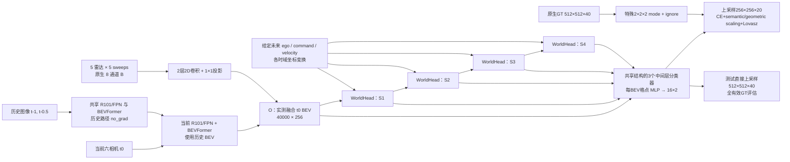

# M0 架构与改进接口审计

审计日期：2026-09-15。范围是本地源码、已回传真实结果与资产回执；没有连接服务器、训练或修改旧仓库，没有调用 skills。远端路径是历史回执中的资产位置，本次未核实实时可达性。机器可读清单及源码 SHA 见同目录 `architecture_inventory.json`。

**建议首先建立原生 M0 的 t0 状态缓存，再训练可改变整个 future_pred_head 的模型。优先验证“实测记忆与生成状态分离”，以三维空间解码器作为第二条结构方向。** 两者分别针对信息在递归预测中的持续可访问性和稠密空间表达，均不同于在固定未来特征后训练 20,016 参数的点头。现有结果没有证明这两处结构已造成主要误差；需要干预对照。

## 1. 当前证据支持什么

| 已验证结果 | 可以支持的判断 | 不能支持的判断 |
|---|---|---|
| 完整 5,119 样本：M0 pooled future GMO 13.9758%，M1 13.6997%，OccProphet 11.9789%；IR-WM 共同 4,969 样本为 14.4288%，相应 M0 14.0060% | M0 是现有可复用的可靠锚；IR-WM 的结构值得研究 | 不同模型、训练与 ego 条件的差异不能归因于某个融合机制；两个子集不能直接混排 |
| R2/R3 固定 M0 未来特征，修改查询/风险目标能明显改变 NLL、AP 和默认 IoU | 任务权重与操作点确实重要；只看自然 NLL 会掩盖极稀疏前景代价 | 没有直接训练未来预测器，不能由此断定 M0 时序表示无法改善 |
| R4 新 evaluation32：原始 AP 为 M0 12.443%、B_P0 13.805%、B_P2 13.764%；固定校准风险预算后的 GMO 增量 +0.2496/+0.2243 pp，区间跨零 | 类别平衡头改善排序；校准恢复部分默认决策失配；当前点分支尚未证实增量 | 不能写成全面优于 M0，不能写成雷达无用，P0 本身含雷达 |

R4 的主 GMO 是各时域汇总混淆矩阵后再平均；旧完整验证报告的 future pooled GMO 合并四时域。主实验必须固定一种主聚合，并保留另一种为附加结果。R4 的两组 32 场景均来自历史暴露的官方 val；不能作为新盲测数据。上述数字均来自已有真实回执，未填入 mock。

## 2. 实际 M0 计算图和可训练路径

### 2.1 输入、状态与模型容量

- 任务是给定未来 ego/action 条件的 **GMO/non-GMO 二分类未来占据**，预测 0.5、1、1.5、2 s；不是 17 类语义 mIoU，也不是无未来条件的闭环预测。GT 范围为 x/y ±51.2 m、z −5 至 3 m，网格 512×512×40，0.2 m。
- 有效 M0 图可从 `analysis/sota_p2_20260911/configs/S0.py` 读取，但 S0 的 seed0、LR、4 epoch 是旧续训运行设置，不能当成原 M0 24 epoch 的训练设置。
- 当前图像编码为 R101 + DCNv2 + 4 层 FPN（256 维）；BEVFormer 为 6 层视觉/时序编码，输出 200×200×256。WorldHeadV1 有 3 层未来 decoder，三层都有各自分类器和辅助损失。仅未来 head 的 BEV query table 就有 40,000×256 = **10,240,000 参数**；完整 head 参数量需实际模型实例化统计，本机无 torch，未假造该数字。
- 历史两帧通过共享网络生成 BEV，但当前默认 `backwarded_prev_frame_num=0`：历史图像、历史 BEV 均在 `no_grad` 中，历史段临时 eval 后恢复 train。当前图像路径、雷达编码器、未来 head 保持可训练（除原 backbone frozen stage / BN 冻结策略）。配置中的检测头分类/框损失不等于实际使用；本路径调用 `only_bev=True`。

证据：`bevformer.py:158–247`，`drive_occworld.py:840–920`，S0 配置 `71–260`。

### 2.2 雷达如何注入

原生雷达 B 有 8 通道：有点掩码、归一化 log count、高度、RCS、补偿 vx、vy、速度、时间差，5 传感器各 5 sweeps 转到当前 LIDAR_TOP，经过配置中的规范化。RadarBEVEncoder 的 8→64→64 两层 3×3 卷积、GroupNorm、ReLU，再经 1×1 64→256 投影，以加法融合到 t0 camera BEV。`zero_init_residual=True` 只描述初始投影，不说明训练后的 M0 雷达输出为零。

M0 中 posterior/advection/motion_residual 均未启用。雷达仅在参考帧显式注入一次；随后可通过状态隐式保留，但没有一个独立、持久、每步可直接读取的原始雷达/实测参考 memory。历史 BEV 路径也不逐帧融合雷达。

**R2/R3/R4 的 B_common 不等于原生 B。** `extract_common.py:16–32` 为点表建立共同过滤条件，再重算 B；`35–68` 替换融合调用，实际将 B_common 送给 M0。因此这些诊断中的 M0 身份是“同权重、共同源输入”；新主模型应恢复原生 B、同原始 loader/source hash，再以该协议下的 M0 为锚。不能将 B_common parity 写成原生输入 parity。

### 2.3 时序 memory：有递归梯度，但实测状态会退出 memory

`memory_queue_len=1`。世界预测器初始 memory 是 t0 融合状态；每步将最后一层 `pred_feat` 放入 memory，丢弃最旧项。第一步后 memory 只剩生成的 S1；第二步不能直接从一个独立槽访问 O。源码的 `measured_ref_bev` 变量仍存在，但 M0 未启用的三个运输模块才会使用它。

**未来预测没有 detach。** 在 `supervise_all_future=True`、`valid_frames` 包含 1–4 时，S1→S2→S3→S4 的梯度是贯通的。若新缓存训练调用 `future_pred(..., valid_frames=[])`，则源码会进入 `torch.no_grad()` 分支，构成新工程错误；必须明确传 `[1,2,3,4]`。`valid_frames` 控制计算图，不等于对输出/GT 自动选帧，损失选帧还需单独对齐。

每步 query table 与空间位置编码共享；`target_frame_index` 用于索引 future canbus、command、velocity，没有独立的 horizon embedding。当前递归状态本身使各步可不同；改成 t0 直接多时域时必须提供显式 Δt，不能在静止 ego / 同 action 情况下把各时域变成同一输入。

证据：`drive_occworld.py:475–594`，`world_head_base.py:279–435`。

### 2.4 未来 ego 条件与标签语义

数据集从标注未来 ego 位姿计算 `future_can_bus`、`ref2future`/`future2ref`、future velocity；M0 使用未来 Δx/Δy/Δz/Δyaw、command、vx/vy，并通过 conditional normalization 与 attention 坐标变换使用未来姿态。`future_metadata_only=True` 省去未来图像读取，不会消除未来元数据条件。当前编码器只见历史/当前图像，不能把它误写成读取未来图像。

canonical loader 将源类 `[2,3,4,5,6,7,9,10]` 合为前景 1；`[0,1,8,11,12,13,14,15,16]` 合为 0，255 保留忽略。GMO 是可移动语义类别，可能包含静止/停放车辆；0 同时包括未占据和静态类别，不能统称“空体素”或“实际静止”。稠密数组初始为 0；没有在本审计确认的额外可见性/自由空间掩码，因此不可把所有 0 都解释成传感器明确观测到的 free space。

GT occupied points 按 ego/calibration 变换到参考 LIDAR_TOP，再体素化、冲突投票。未来查询又使用未来 ego 几何。现有 canonical GT 比较有真实样本 parity，但改动几何链前仍需独立静态场景/ego 变换夹具；本审计不据此宣称存在坐标错误。

证据：`nuscenes_world_dataset_v1.py:161–267`，`loading_occupancy.py:53–120`。

### 2.5 解码和训练目标并不是自然全 GT NLL

每个 BEV 格点由 MLP 256→256→(16×2) 产生高度 logits；空间依赖来自前面的 transformer，输出端没有额外 3D 卷积或多尺度空间 refiner。最终预测分辨率 200×200×16，测试三线性上采样到 512×512×40 再 argmax。

训练先将 GT 512×512×40 变为 256×256×20：空块取0；非空 2³ 块里的各个0被替换成彼此不同的负整数，再取 mode；负值结果置255。例如 **一个1+七个0 → 255忽略**，不是 max pooling，也不是普通多数投票。该行为在主仓库与 reference 的 `world_head_v1.py` 完全相同，且已有 `test_occ_target_downsample.py` 保护；不能称为这次新引入的 bug。本审计未测真实数据被忽略的前景比例。

三层预测都上采样到 256×256×20，使用 CE（类权重 `[1,5]`）+ semantic scaling + geometric scaling + Lovasz，每项系数1，监督当前加四个未来时域。因此 R2/R3 的自然全 GT NLL 既不是 M0 原训练目标，也不等于 M0 原目标的无偏估计。改变下采样/风险目标本身需要对照，不能与结构改动一起后再单归因于模型。

证据：`world_head_v1.py:15–35,61–74,97–121,195–235`；`drive_occworld.py:596–615,712–744`。

## 3. 两条更本质的实现方向

| 维度 | A：持久观测 memory + 生成状态 | B：三维、多尺度空间解码与监督 |
|---|---|---|
| 核心假说 | 生成状态迭代时，难以保留的实测信息缺少持续访问渠道，长时域误差累积 | 压缩成单个 BEV 向量后逐格输出16层高度，叠加特殊 GT 下采样，限制稀疏/细长对象和空间连续性 |
| 改变的计算 | O 固定，S_h=T(S_(h−1), O, action_h, Δt_h) | 未来 BEV→可学习高度提升→三维/分解空间多尺度 refiner→occupancy |
| 训练范围 | 整个 future_pred_head，初期冻结视觉/雷达编码器 | refiner + 原未来预测器联合反传，初期冻结视觉/雷达编码器 |
| 能复用的 M0 权重 | 几乎所有原未来 head；新增观察入口显式迁移/门控 | 原未来 transformer 和原 logits 路径；新增空间层作为初始零残差更易确保 parity |
| 主要工程风险 | 两 memory 的几何坐标、attention level 扩维、归一化竞争 | 三维显存、特征基不匹配、高度/xy 轴顺序、稀疏标签风险的变化 |
| 推荐次序 | 第一结构实验，先证实观测入口确实参与预测 | 第二方向；先拆开“空间表达”和“监督语义”贡献 |

### A. 持久观测与生成状态分离

建立固定 O（真实 t0 融合 BEV），生成状态 S 逐步更新；O 的坐标始终绑定 t0，S 的坐标绑定上一预测时域。它可以是两槽 memory 或独立 observation cross-attention 分支。**这不是简单把 memory_queue_len 从1改为2：**

1. `prev_frame_embedding` 从 `[1,256]` 变为 `[2,256]`，需记录 old→new 参数映射和 observation/generated 槽类型；不能把“历史队列年龄”默认为“信息来源类型”。
2. `WorldDecoder` self-attention 仍只有当前 query 一个 level；只有 memory cross-attention 扩至两 level。后者的 `sampling_offsets` 与 `attention_weights` 输出维度都随 levels 扩张。简单重复权重会改变 softmax 的注意力分配，不能宣称初始等价 M0。
3. 优先用显式 gate/mask 保证新增观测分支初始为零贡献，并验证关闭 gate 时严格恢复 M0；若采用共享两 level attention，初始新增 level 需真正屏蔽，同时保存生成槽旧参数，而不是只把新 logits 置0。
4. 每槽独立传入 future→memory 坐标与 conditional-normalization 的 `future2history`。不要给两个不同时间来源复用一个 rigid transform。Δt 输入与槽类型编码分开，避免时间被 ego motion 代替。
5. IR-WM 的 residual state 更新可作为一个有明确先例的对照，但相加前要明确状态坐标基。不能把“残差预测”本身包装成新颖贡献。

**非平凡单元验证：**原模型迁移、关闭新分支时四时域 logits/整数 confusion parity；启用观察分支后，保持 S 相同、只改变 O 时输出与 O 梯度发生可测变化；独立平移/旋转 phantom 核对两槽采样；t0 输入不含未来图像/未来 occupancy；第4步损失对第1步状态、未来 head 参数的梯度有限非零；静止 ego 但不同 Δt 的直接预测输入仍可区分；批量2时交换样本不交叉污染。

**必要实验对照：**同初始 M0、同 native cache、同样本顺序/seed11/更新预算的原 memory1 续训；新增容量但两个槽只读生成态的容量对照；持久 O+S；仅 residual state 的开源机制对照可在主效应出现后追加。对照数量由总预算决定，不要求一次跑全；必须先有原 M0 同协议续训。除了四时域指标，还应测实测 O 干预敏感性及误差随时域增长，不能只报告更好的平均数。

### B. 三维空间 refiner，连同监督口径做可分辨实验

可将未来 BEV 通过 learnable height lift 变成 `[B,T,C,H,W,Z]`，在较低 xy 分辨率使用多尺度 3D 卷积或 xy/height 分解块，再回到原 200×200×16 logits。举例 C32、100×100×16 的单时域特征有512万 float（20.48 MB）；这只是特征张量下界，不含多层反传/优化器，不能据此估计完整显存。M0 的256维不是原生16个独立高度特征，不能直接假定无损 reshape 成32×16。

OccProphet 的 `UNetPredictor`、`HybridFusion` 可作为机制实现参考：pre-UNet 压缩，ConditionalGenerator 预测未来，post-UNet 联合看到观测与预测状态；HybridFusion 分场景、BEV、height 分支。M0 可先只迁移空间 refiner 思路而保留原时序预测，以避免同一实验同时替换两大模块。训练允许整个 future_pred_head 梯度更新，不能再次冻结未来特征后仅加后处理头。

监督侧先量化原特殊 pooling 的影响。若使用按粗体素记录 `(n0,n1,nvalid)` 的 soft/count 监督，它在粗块共享同一 logit 时可精确表达该块原生 BCE 总和；**经过三线性插值、块内 logits 不相同时不再精确**。要声称原生全GT风险，应采用原生插值位置的损失或有明确定义的抽样估计，不能把任意 soft label 当成原目标。Lovasz/scaling 与自然 NLL 是不同风险，需分别保存。

**非平凡单元验证：**单前景体素、薄杆、相邻两物体、同xy不同高度的解析 GT；所有原生有效标签计数守恒；height/xy 轴置换不被静默接受；resize/warp identity 与边界 phantom；输出层零残差时 M0 parity；第4时域空间损失可到达未来 transformer；真实单批次的前景/非前景/忽略 count 与原生 GT hash 一致。

**必要实验对照：**至少把空间 refiner 有/无与原目标/新目标两因素分开；若预算不足先只改结构、保留 M0 原损失，之后单独量化 pooling 的支持损失。参数接近的2D空间 refiner可检验收益是否来自三维高度结构，而不仅是更多容量。不因小样本 NLL 下降就升级论文主张。

## 4. 可直接复用的开源资产，以及不能直接替换的部分

| 资产 | 已知接口和用途 | 限制 |
|---|---|---|
| M0 epoch24 | SHA `0348dc8f28d2959637dcd9ac7ccd29fea0da20c25c9856cdb4709c3e221dd9dc`；视觉/雷达/未来 head 原权重 | 原生输入与 B_common 输入要分开标识；只加载模型，不恢复旧优化器/epoch |
| IR-WM local HEAD `a83e4a24…` | 同族200×200×256 BEV；`drive_occworldV2.py:374–384` residual 累加；optional `use_lwm` 使用未来观测 BEV teacher | 已评估官方 checkpoint 是17类 fully-decoupled+planning，不是二类 fine-GMO；未来 xy 为预测规划，旋转/z仍来自标注。`use_lwm=False` 是默认，不能称已评估权重必用了 teacher；本地 world_head_base 有可视化写盘副作用 |
| OccProphet local HEAD `d41f8ae9…` | `UNetPredictor.forward` 接收6维 `[B,T,C,H,W,Z]`；官方 LSS 64通道、128×128×10，pre-UNet变32通道；3观察→6输出，post-UNet看9时刻 | R34/LSS 的特征基与 M0 不同，不能无缝加载整块 checkpoint。官方 SyncBN、动态核维度、输出时序/高度需重新适配；ConditionalGenerator 默认 `leave_attn_unused=True` 有明确 legacy 注释，新训练要核实 unused parameters |
| R2/R3 cache 与20,016参数 heads | 已有 train128/dev32，完整未来 GT、final future features、logits、common radar；可做历史诊断/目标连接复核 | 无 t0 reference BEV、无历史图像特征、无三层全部中间状态；不能用它重新训练世界预测器。旧 dev / R4 calibration/evaluation 标签不应转成新训练集 |
| 原 canonical label/evaluator | 已多次真实逐体素和整数 confusion parity；可保持新方案评价不漂移 | 新几何/输出尺寸仍要独立 phantom 与真实重放；完整 pooled 与 horizon macro 应显式区分 |

原主仓库与 reference 的 `bevformer.py`、`world_head_base.py`、`world_head_v1.py`、`world_decoder.py`、canonical loader 本次逐字节一致；detector 不同，主要含 M3/P2 可选路径与科学评估扩展。M0 禁用可选模块时仍应通过真实重放证明等价，不只靠静态判断。两目录没有可用 .git，已记录源码 SHA，未编造提交号。

## 5. 首个工程接口：native t0 状态缓存

**建议冻结到 `future_pred` 的完整输入边界，而不是从 R2 未来特征反推 t0。** 以原生 M0 eval 状态、原生 radar loader 和固定图片变换得到 O；缓存编码器已经冻结，因此这条训练路线的主张是“固定 M0 感知下重学未来预测器”，不能称端到端传感器训练。

每条记录至少保存：

- `sample_token/scene_token/lidar_token`、split、源图像/雷达/GT路径或内容身份、配置/源码/权重 SHA、提取模式/TF32/随机设置。
- `reference_bev` float32 `[1,40000,256]`，原生 `radar_bev` `[8,200,200]` 及其 SHA。保留原 dtype/轴契约；勿先量化为 fp16。
- `future_pred` 输入的 `prev_bev_input=[1,1,40000,256]`、`action_condition_dict` 的 command/vel_steering、`plan_dict` 的 gt_traj 与必要占位、`cond_norm_dict` 的初始状态、当前/历史 metadata 与 `num_frames`。不保存被调用后原地更新的字典当初始输入。
- 未来几何的完整矩阵及尺寸语义；先缓存原函数实际用到的 metadata，验证重放后再删冗余。保留 ndarray dtype / quaternion / matrix 行列约定，JSON 转换不能丢类型或精度。
- 当前+未来五帧原生 GT uint8 `[5,512,512,40]`，0/1/255计数与 hash；这样未来任务能选 `[1:]`，同时可重现原 M0 current+future 损失。无须为此缓存历史图像到训练包。
- 原生 M0 五帧 coarse logits、全 GT confusion（GT行/预测列）、每时域特征/预测 hash，供 exact-replay 验收。若节约空间，可在 parity 通过后按冻结策略仅保留抽查 logits，其余保留 hash/统计；不能先扔掉验证基准。

预计上述 f32 t0 BEV+五帧GT+五帧logits+native B 约120.3 MB/anchor，加元数据与压缩开销另计。256/512 anchors 未压缩约30.8/61.6 GB。比现 R2 228.8 MB/anchor 少，是因为不保存四个固定未来256维状态。**这是数组计算，不是实测磁盘占用或训练速度。**

必须先通过四项：① 真实样本完整原生路径 vs缓存重放的4h输出/整数混淆矩阵；② 训练 `valid_frames=[1,2,3,4]`，第4步损失到早期生成状态与所有预期未来模块的梯度；③ 同一 batch 的 train/eval 模式差异可解释，不把 dropout 差异当缓存错误；④ GT和metadata完全不进入编码器输入。缓存重放通过后才把该接口作为 A/B 共同基础。

## 6. 预算建议与会导致失败的实现细节

这里给出资源上限建议，不是新训练已启动或已获效果。此前双 H200 的原生 S0 100-update 实测约0.8384 s/microstep；完整四轮纯训练21.92088 H200 GPU小时，约5.48 GPU小时/epoch；S1约22.87 GPU小时。模型缓存训练能省下图像与感知前向/反传，但这部分收益没有实测，不能套用 R3 四个小头约285秒的速度。

建议先以最多100 updates/1 GPU小时做新接口 learnability/内存/吞吐检查，记录未来 head 参数量、激活峰值、有效标签支持及各时域梯度；这只能检验可训练性。根据实测再冻结样本/更新预算。若选择全原生端到端 matched continuation，可用单臂1 epoch（含评估）8 H200 GPU小时为筛查上限，两臂16；扩大到4 epoch前另核算约24–30 GPU小时/臂。若选择 t0-cache 训练，先报告一遍独立样本覆盖与预计更新成本再确定上限，避免又用重复128 anchors证明泛化。单seed11；所有臂串行，新输出目录，deadline/SIGTERM checkpoint，无自动科学重试。

需要在新代码中显式解决、但本次没有修改的风险：

1. `bevformer.py:199` 的 `_obtain_backwarded_history_bev` 需要 `prev_bev_list`，`242–244` 调用漏传；目前默认0不触发，启用历史反传会 TypeError。且该分支历史图像 feature extraction 仍 no_grad，不能仅改一个开关声称全部历史视觉可训练。
2. 旧 `train_entry.py` 校验并硬编码 seed0、4 epoch、旧学习率合同；旧 shell launcher 也有过时路径。新实验应新建入口、明确 seed11 和模型迁移白名单，不借旧入口偷偷改变其合同。
3. 参数迁移不能笼统 `strict=False`：记录每个新增/缺失/变形 key，比较旧生成分支初始输出和 source checkpoint SHA。
4. 可见性与实际运动标签尚未确认；“运动物体可靠性”分层需额外速度/instance定义，不能把GMO=1直接当moving。
5. 分辨率/目标/权重/输入源/预测时域任一变化都需在 M0 对照使用同样合同；R4校准参数也不能直接移植给新模型而宣称固定风险保证。

## 7. 证据入口

- `analysis/m0_comparison_20260910/M0共同样本结果.md`，`analysis/vision_baselines_20260908/执行状态.md` 与各官方权重/完整推理回执。
- `analysis/r2_execution_20260914/R2结果与推进决策.md`、`extract_common.py`、`train_heads.py`。
- `analysis/r3_execution_20260914/R3结果与推进决策.md`。
- `analysis/r4_execution_20260914/R4结果与研究决策.md`，真实 summary SHA `cb40a012b77d73004bc3df90459e26289d944d6998ad6cf8548d441800fa1828`。
- `analysis/sota_p2_20260911/configs/S0.py`、`train_entry.py`、`P2执行状态.md`。
- 本地源码与论文机制仅用于可复用接口判断；本审计没有给出新颖性结论，外部文献与顶会定位由主任务的独立文献审查综合。
