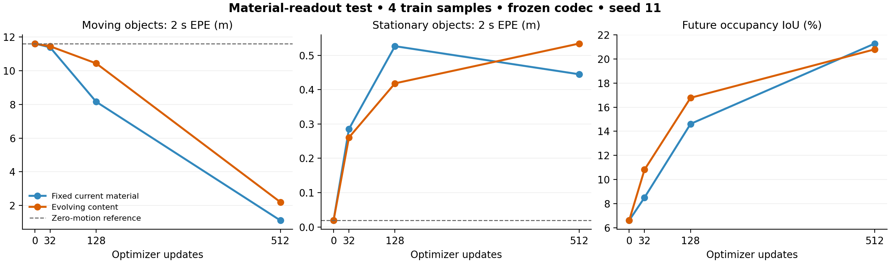

# 固定材料内容与递推动力分离：T/J 结果与决策

日期：2026-09-17。两臂各 512 更新，真实 H200 运行完成；432 个聚合标量复算差为 0。**同样四个训练样本、单 seed11，无开发集或 O 比较。** 不将本结果写成泛化、同等性能或已超过 O。

## 主要发现

固定 renderer 的当前内容，仍保留完整递推状态和可训练运动网络，能够在 train4 上保持较高占据 IoU，同时降低物理运动误差。自由 future-content 改写不是这四个样本取得较高占据拟合的必要条件。

| 最终512更新 | future IoU (%) | moving 2s EPE (m) | stationary 2s EPE (m) |
|---|---:|---:|---:|
| T：固定当前内容，学习递推与位移 | 21.281487 | 1.116312 | 0.444758 |
| J：同步重跑，自由递推内容参与读出 | 20.801779 | 2.204467 | 0.534174 |
| 零位移物理参考 | — | 11.610732 | 0.019072 |

T−J 的 IoU 为 +0.479708 个百分点，moving EPE 降低约49.36%，stationary EPE 降低约16.74%。但静止误运动仍远高于零位移参考，不能称已解决运动准确性问题。物理评价使用原 rigid-box 材料点代理、对象等权、原完整 population：2s moving 40对象/5759点，stationary 49对象/4566点；不是实测表面 scene flow。

图中全部是真实数据，无 mock；只在预定 0/32/128/512 检查点测量。连线不是额外测量。

## 这次实际改变了什么

T/J 使用完全相同的初始参数、网络和递推 S_h。J 将 S_h 送入 splat；T 将固定编码当前状态 S_0 送入 splat，位移依然由同一递推网络预测。encoder/decoder 全程冻结，原 CE+Lovasz+0.1 physical、AdamW、lr、输入顺序、更新数均相同。没有删除 content_increment 或 detach recurrent state。

CPU 非零权重检查确认：evolving 模式与原生模型 logits 完全一致，同参数下 T/J 位移完全一致；T 置零地址恒等于当前持久预测；T 最后一步 increment 的直接读出梯度不存在，但较早 increment 仍通过后续位移获得梯度。实际训练中递推、increment、velocity 均记录了梯度与更新，不能把 T 描述为 content_increment 不参与学习。

T 正常/零位移/反向位移 future IoU 为21.281487/6.606962/3.222034%；J 为20.801779/9.479668/5.836866%。T 的高占据分数确实依赖运动地址，但它依赖的是 dense latent 传播，不是已经恢复的独立物体身份。

## 必须保留的限制

1. 上一轮 J 为22.093264%，本轮同步 J 为20.801779%，同种子重复差1.291485个百分点，大于本轮 T−J 的0.479708个百分点。该数值政策含非确定性 CUDA reduction；当前不能将小 IoU 差宣称为稳健胜出。保留两次结果，不挑较弱 J 作正式 baseline。后续训练预先固定确定性数值政策，不在 train4 重跑直到得到有利数值。
2. 最终 T 的全动力参数梯度 cosine 为−0.2494，而 J 为+0.1847；T 的独立 velocity cosine 也更负。T 物理误差却更低，因此“梯度更冲突必然学得更差”不受这次数据支持。局部 cosine 不是整个优化过程的充分解释。
3. 固定 C0 包含背景及混合 voxel；当前 codec 仅经过前序32次小样本 current-shape拟合，不能从这一瓶颈推断大数据下的最终容量。全网格未标注部分位移仍缺独立物理认证。
4. 两组没有未来新生内容模型，也没有直接接入独立 Doppler 量测。因此本结果不证明雷达可减少真实图像历史，也不证明系统加速。

## 下一步决定

本问题的 train4 对照到此结束，不再围绕四个样本调系数。保留 O/M0，推进原 train512/256场景上的共同 current codec，再比较固定材料传播、自由未来内容和更强直接未来状态基线。共同 codec 先只学习当前占据，未来任务阶段再使用未来监督；这样不会因每个候选拥有不同当前表示而混淆。

后续使用原 dev200 进行开发，同时提前记录[场景分离的确认人口](scene_disjoint_confirmation_population_v1.json)：原验证集排除dev200的全部100场景后，余50场景/1707锚点，与train512场景也不相交。该集合与原历史 locked 分区相同；完整验证集有既往使用，因此不称全新盲测。新候选确认推理尚未运行。

DDPAE/PhyDNet/GaussianWorld 的[论文及源码核对](research_notes/material_state_literature_20260917.md)支持区分持久内容、运动与未知变化这一研究方向，也限制新颖性。我们后续应证明运动量测怎样改善可被任务使用的状态，而非将已有“内容—运动分离”重新命名。

## 证据

- [冻结协议](dense_material_learning_curve_protocol_v1.json)：SHA256 `98d398c3090c88ec2bf5da6859cb50a387511b7bf00deee0308b1d129907290e`。
- 完成文件 SHA256：`34c6065f857ca05fb971d75987ead0f236945e280a97c3dc3e492c92b37204ef`；八个返回文件与服务端完成清单逐一核验。
- [聚合审计](dense_material_learning_curve_evaluation_v1/aggregate_audit.json)从逐样本混淆矩阵和逐对象日志复算432指标，max abs0，固定分母、t0、输入顺序和初始化一致。这不是第二套独立逐点几何实现。
- [CSV](dense_material_learning_curve_evaluation_v1/learning_curves.csv)、[模型](dense_material_state_v1.py)、[训练脚本](dense_material_learning_curve_v1.py)、[汇总脚本](summarize_dense_material_learning_curve_v1.py)。
- runner为EXITED_ZERO，原runner/child均已不存在。初始化曾出现实际文件I/O等待；总用时不能当作正式推理效率。完整资源与进程核验收据见本地`dense_material_learning_curve_remote_readonly_v1.json`。

未更新 O/M0，未启动外部官方baseline训练，未采用多种子。
