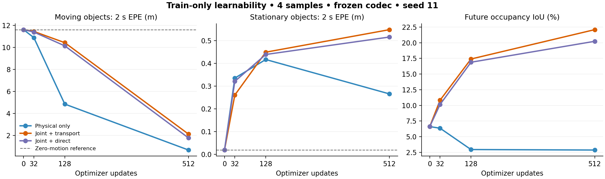

# 自有状态的运动可学习性：固定 train4 学习曲线

日期：2026-09-17。状态：1536 次真实 H200 优化更新完成，三组各 512 次；648 个汇总标量独立聚合复算一致。**仅四个训练样本的诊断，未读取开发集，不是泛化结果，不与 O 的 5119 样本结果直接比较。** P/J/D 仅为本实验局部缩写，不指历史同名字母路线。

## 主要发现

32 次更新时物理运动接近零参考，不能据此判定不可学习。延长到预先固定的 512 次后，三条曲线都学到了非零运动。物理单任务的 moving 2 s EPE 降到 0.676 m；联合占据与物理目标的 transport 取得更好的训练占据 IoU，但相较相同目标的 direct，运动误差仍更高。任务连接有效与运动更准确必须分别验证。

| 512 次更新后的条件 | 原全域 future IoU (%) | moving 2 s EPE (m) | stationary 2 s EPE (m) |
|---|---:|---:|---:|
| P：仅物理监督，transport 评分 | 2.862879 | 0.675769 | 0.265575 |
| J：占据+物理，transport 读出 | 22.093264 | 2.120555 | 0.547930 |
| D：占据+物理，direct 读出 | 20.233471 | 1.773825 | 0.515507 |
| 零位移参考（初始化） | 6.606962 | 11.610732 | 0.019072 |

EPE 使用原稀疏材料点、对象等权、原实际时间间隔，moving/stationary 的定义和全部原对象不变。IoU 为原五时刻二分类细网格，future 对四个未来时刻取均值；不是语义 mIoU。零位移是物理误差参考，表中的 IoU 是共享初始表示的 persistence 读出，不是已经训练后的 J/D 置零干预。

所有图中数值均为真实本轮诊断，不含 mock。图中只展示已固定的 0/32/128/512 四个检查点；连线不是未记录更新的测量值。

## 协议和复算

三个条件共享同一 codec 和完整初始参数。encoder、decoder 全程冻结，训练 dynamics/content_increment/velocity；单 seed11、同样的四样本顺序、AdamW 3e-4、weight decay 0.01、clip 10，每组 512 次，未选最优 checkpoint。P 使用 0.1×原 object-group SmoothL1；J/D 增加原占据 CE+Lovasz。P 训练时跳过没有进入 loss 的 splat，评分时仍采用 transport。完整模型 107458 参数，其中 52720 可训练。

协议 SHA256：`51d69b8b73543c81c0c011ec6c98ce87eae2d0c0141733776f228a1f38530679`。
完成文件 SHA256：`34828150c3c532e1d48111e32c879cc25e6c3167a82a75929624f8d661aec402`。
训练脚本记录耗时 701.988 s，峰值 allocated 3.443 GiB；共享 H200 的工程耗时，不能用作正式系统速度结果。durable runner 以 EXITED_ZERO 退出，子进程退出已核验。

[汇总核验](dense_state_learning_curve_evaluation_v1/aggregate_audit.json) 从每样本混淆矩阵、每对象记录重新计算 648 个指标，最大绝对差 0，并检查相同 GT 分母、冻结的 t0 预测、相同初始化和全部 512 次输入顺序。这是聚合层复核，不等于另一套独立逐点 EPE 几何实现。[CSV](dense_state_learning_curve_evaluation_v1/learning_curves.csv) 与 [生成脚本](summarize_dense_state_learning_curve_v1.py) 一并归档。

## 机制证据及其边界

J 的正常 / 零位移 / 反向位移 future IoU 分别为 22.093264 / 10.249767 / 6.374622%；D 三种完全相同。说明 J 的预测真实依赖传播地址，D 的独立速度输出不进入占据读出。不能据此证明 J 的速度物理上更准：J 的 moving 和 stationary EPE 都劣于 D。

不能将 P 低 IoU 解释成“物理准确性有害”。P 的 content_increment 和共享动力状态也由物理目标更新，但没有占据监督约束其内容；较好的位移伴随内容漂移，可能使固定 decoder 不再适配。需要固定最终 checkpoint 的内容/位移交叉读出区分这些因素。

梯度诊断也不支持“所有任务梯度都冲突”：512 更新时 J 全部动力参数上的平均 cosine 为 +0.08247，而独立 velocity 参数上的 cosine 为 -0.03308。P/J 同时改变共享状态与内容的学习，不能当作只改变速度梯度的因果对照。记录了真实梯度与参数更新：velocity 首步有非零梯度，动力干路第二步开始；P 的 content 第二步开始，J/D 第一步开始。更新范数包含 AdamW decay，不能把 loss 权重 0.1 解释成参数更新恰好缩小十倍。

## 阶段性决策

保留 O/M0。停止用 32 更新的接近零运动结果否定当前表示可学习性；也不把 train4 的 22.09% 写成超过 O。当前可回答的是任务连接与小样本拟合问题。优先完成无需训练的交叉读出，再决定如何约束内容与运动的分工；之后才冻结更大训练集和独立确认场景。静止误运动仍显著高于零位移参考，下一阶段必须共同报告 moving 收益与 stationary 代价。

用户提出的 [雷达动态先验减少视觉历史计划](雷达动态先验与视觉历史效率_实验计划.md) 已列为高优先级后续贡献假设。当前输入是缓存融合 BEV，不能把本实验归为真实单帧相机设置，也不支持端到端历史效率结论。

## 固定最终 checkpoint 的交叉读出：已完成

将每个模型的未来 content 和累计 displacement 在同一 observed BEV 上各提取一次，在相同冻结 decoder 中构造 4×4 组合。current 表示固定当前内容；zero 表示恒等地址。参数不更新，不读 GT 生成输入、筛选掩码或选择组合，原全域分母一致。下面全为 future IoU (%)，仍只在相同四个训练样本上：

| 内容来源 \ 位移来源 | zero | P | J | D |
|---|---:|---:|---:|---:|
| current：固定当前内容 | 6.6070 | 10.3479 | 12.5086 | 9.2113 |
| P：仅物理监督内容 | 2.0003 | 2.8629 | 3.0838 | 2.7556 |
| J：联合 transport 内容 | 10.2498 | 18.1734 | 22.0933 | 18.0652 |
| D：联合 direct 内容 | 20.2335 | 13.9572 | 15.5712 | 14.1043 |

P/P 与 J/J 是对应模型的原生读出；D/zero 才是 D 的原生读出，D/D 是额外施加传播的反事实组合。该矩阵区分固定表示与地址配合关系，不是两种独立可加的因果贡献。

三个实质判断：

1. P 的运动在固定当前内容上有占据效用（6.607→10.348），而 P 内容在 zero 和各个位移下都较差。支持“仅物理监督造成内容偏离冻结占据 decoder 所需表示”这一解释；**不支持物理运动越准就越损害占据**。共享动力参数和内容本身都改变，不能将下降全部量化归给单个模块。
2. J 内容使用本身位移得到 22.093%，换成稀疏物理 EPE 更好的 P 位移却只有 18.173%。物理材料点评价与全网格特征地址效用并不等价，未标注区域运动、内容—地址适配和 decoder 非线性仍会影响结果。不能宣称速度越准一定越好，也不能宣称 J 学到了更准确物理速度。
3. D 内容直接读出最好（20.233%），再施加 D 位移反而降到 14.104%。这与“内容本身已编码未来位置，重复传播造成地址不匹配”相容，但并未唯一识别双重位移机制。direct/transport 的内容语义不能默认可互换。

因此下一步优先检验**内容对材料点的保持与运动承担空间迁移是否可以同时成立**。候选设计是把持久材料内容与新出现/遮挡变化分开，允许后者更新，但约束前者不通过自由内容改写绕过运动。需要同时设置固定当前内容、自由 future-content、受约束材料内容对照，并在原占据与 moving/stationary 物理指标上共同检验；这是待设计假设，尚未实现或启动新训练。不能仅因本矩阵就决定新增 loss 或宣称实体表示有效。

数值过程完整保留：v1 在首个样本的 P/P logit parity 处失败，未输出完成矩阵。v2 只将审计推理改为确定性算法、cuDNN deterministic 和 CUBLAS workspace 配置，保持 checkpoint、模型源文件、评分人口和原 `atol=rtol=1e-5` 不变。v2 所有原生重构 logit 最大差为 **0**。这解决了本轮重构数值一致性；原失败与 CUDA reduction 非确定性相容，但没有单独隔离到唯一算子。

[交叉读出原始汇总](dense_state_cross_readout_v2.json)；[96 标量聚合复算](dense_state_cross_readout_aggregate_audit_v2.json)。所有 16 组逐样本混淆矩阵求和完全一致。与原非确定性学习曲线相比，J/D 原生混淆矩阵完全相同；P 最大单个计数差为 1（绝对差合计 2），future IoU 差为 1.0573e-7 个百分点，不能声称它与原运行逐计数完全一致。

v2 耗时 84.858 s，峰值 allocated 1.272 GiB，零优化更新；runner EXITED_ZERO，runner/child 均已不存在。结果 SHA256：`144cc8a51839381d082028fb00132e278ca87ec8fcfb3c8b27b483049032a201`。v1 失败记录与 v2 数值政策一并保存。未启动额外训练，O/M0 和其它用户任务保持原状态。
